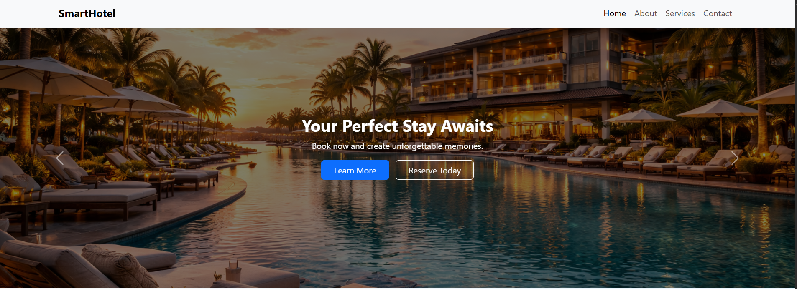
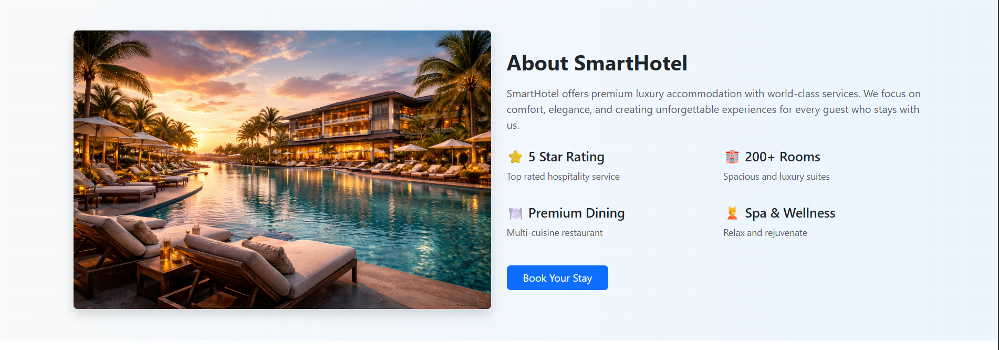
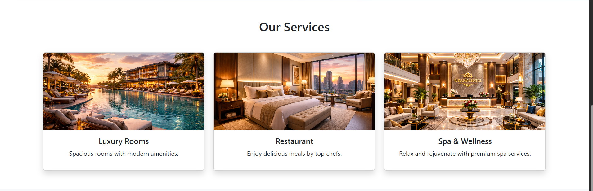

Perfect 👍 let’s upgrade it and make your README look like a polished GitHub project.

Copy this full version and replace your current README with it:

---

# 🏨 Hotel Booking System

<p align="center">
  <b>A Responsive Hotel Booking Website UI</b><br>
  Built with HTML, CSS, JavaScript & Bootstrap 5
</p>

<p align="center">
  <a href="https://ctt-vaishnavi.github.io/Hotel-Booking-System/">
    
  </a>
  
  
</p>

---

## 📖 About The Project

This project is a modern and responsive **Hotel Booking System Website UI** designed to simulate a professional hotel landing page.

It includes structured sections like Home, About, Services, and Contact with smooth navigation and clean layout design.

🔗 **Live Demo**
[https://ctt-vaishnavi.github.io/Hotel-Booking-System/](https://ctt-vaishnavi.github.io/Hotel-Booking-System/)

---

## ✨ Key Features

✔ Responsive Navigation Bar
✔ Bootstrap 5 Carousel Slider
✔ About Section Layout
✔ Services Section with Cards
✔ Contact Form with JavaScript Validation
✔ Smooth Scrolling Navigation
✔ Mobile-Friendly Design
✔ Clean and Organized Code

---

## 🛠 Tech Stack

* HTML5
* CSS3
* JavaScript
* Bootstrap 5

---

## 📂 Project Structure

```
Hotel-Booking-System/
│
├── index.html
├── style.css
├── script.js
├── README.md
└── imgfolder/
    ├── Home.png
    ├── about.png
    ├── Service.png
```

---

## 📸 Project Screenshots

### 🏠 Home Page

<p align="center">
  
</p>

---

### ℹ️ About Section

<p align="center">
  
</p>

---

### 🛎 Services Section

<p align="center">
  
</p>

---

## 🚀 Getting Started

### 1️⃣ Clone the Repository

```
git clone https://github.com/CTT-Vaishnavi/Hotel-Booking-System.git
```

### 2️⃣ Open the Project

Open the project folder and run `index.html` in your browser.

---

## 📌 Future Improvements

* Add backend integration
* Store booking data in database
* Implement user authentication
* Add admin dashboard
* Deploy with full-stack functionality

---

## 👩‍💻 Author

**Vaishnavi Shinde**
Computer Science & Engineering Student

---

<p align="center">
  ⭐ If you like this project, consider giving it a star on GitHub!
</p>

---

This version looks:

• Centered and clean
• Has badges like professional repos
• Screenshots aligned properly
• Better visual structure
• More premium overall

If you want, I can also help you make your GitHub profile README look equally professional.
